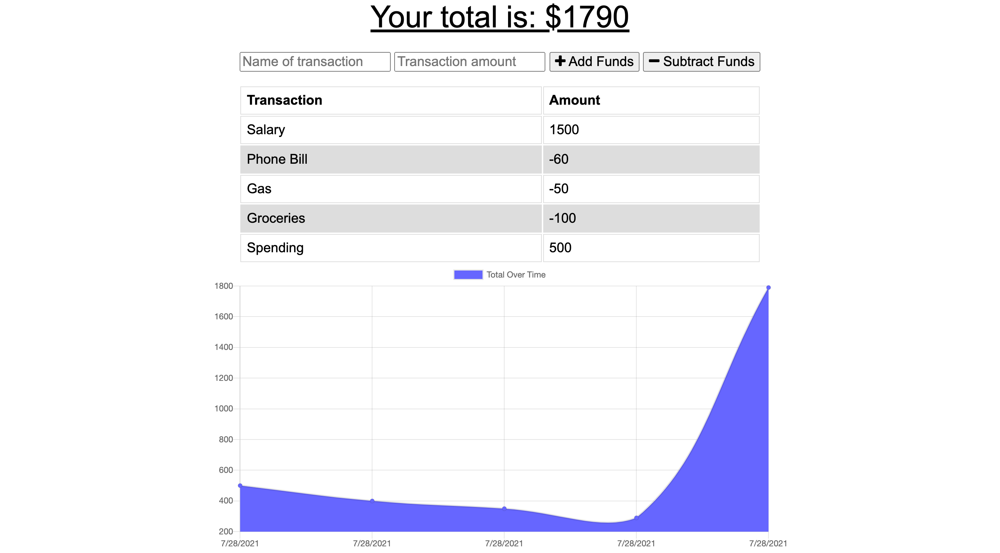

# Budget-Tracker

## This GitHub repository contains code for a Budget Tracker application.

---

### This application contains the code for a simple Budget Tracking application.  It allows for the user to record their expenses by adding or subtracting funds, allowing the user to record both income and expenses. A transaction summary section displays each transaction as it is recorded, and a graph shows the state of the users balance over time. 
### This application code combines the use of an Express server and a Mongo database with Mongoose ODM. Also included is API functionality, which allows for the logging of transactions, and the display of the data entered previously.

---

## Table of Contents

* [Usage](#usage)
* [Motivation and Research](#motivation-and-research)
* [Development](#development)
  * [Web development technologies](#web-development-technologies)
  * [Challenges](#challenges)
  * [Future Development Opportunities](#future-development-opportunities)
* [License](#license)
* [Contributing](#contributing)
* [Questions](#questions)
* [Repository Link](#repository-link)
* [Deployed Application Link](#deployed-application-link)
* [Application Screenshots](#application-screenshots)

---

## Usage

The deployed application can be accessed <a href="https://shrouded-atoll-03478.herokuapp.com/">here.</a>

If you wish to deploy this application to your own Heroku instance you can sign up for a free Heroku account <a href="https://signup.heroku.com/">here.</a>

---

## Motivation and Research

The primary motivation behind this project was to learn how to incorporate caching of data while offline, so that transactions could be entered without connectivity to the internet, and this data would then be added to the budget tracker once the user was back online.

This project also allowed me to continue to work with MongoDB, a NoSQL Object based database and the associated modules required to utilise it with NPM. Mongoose was used to specify an appropriate schema and classify the data types that would be stored within the database.

This application contains the code for a simple Budget Tracking application. It allows for the user to record their expenses by adding or subtracting funds, allowing the user to record both income and expenses. A transaction summary section displays each transaction as it is recorded, and a graph shows the state of the users balance over time.

---

## Development

### Web development technologies

Development of the project was centered around using Express and MongoDB/Mongoose ODM, back end web applications for Node.js that are installed using the node package manager (NPM).

The application is deployed to Heroku, a platform as a service (PaaS) that enables developers to build, run, and operate applications entirely in the cloud..

Node.js, an open-source, cross-platform, back-end JavaScript runtime environment that runs on the V8 engine and executes JavaScript code outside a web browser.

Compression is Node.js middleware used to compress response bodies.

Express is a minimal and flexible Node.js web application framework that provides a robust set of features for web and mobile applications.

Lite-server is a lightweight development only node server that serves a web app, opens it in the browser, refreshes when html or javascript change, injects CSS changes using sockets, and has a fallback page when a route is not found.

MongoDB is a source-available cross-platform document-oriented database program. Classified as a NoSQL database program, MongoDB uses JSON-like documents with optional schemas.

Mongoose is an Object Data Modeling (ODM) library for MongoDB and Node.js. It manages relationships between data, provides schema validation, and is used to translate between objects in code and the representation of those objects in MongoDB.

Morgan is a HTTP request logger middleware for node.js.

Links to the languages and tools used to build this project are included below:

* HTML5
* CSS3
* Javascript ES6
* Node.js :
    * https://nodejs.org/
* NPM :
    * https://www.npmjs.com/
* NPM Packages :
    * Compression :
        * https://www.npmjs.com/package/compression
    * Express :
        * https://expressjs.com/
    * Lite-server :
        * https://www.npmjs.com/package/lite-server
    * Mongoose :
        * https://mongoosejs.com/
    * Morgan :
      * https://www.npmjs.com/package/morgan
* MongoDB :
    * https://www.mongodb.com
* Heroku :
  * https://www.heroku.com/

### Challenges

Working with an offline cache of the web app was a new area of learning when developing this application.  Allowing data to be entered into the application while a user was offline, and having this data be added to the database once network connectivity was restored required research to familiarize myself with how to implement this functionality within a Node application.

The development of this application required the use of several NPM packages, including the installation of Compression, Express, Lite-server, Mongoose and Morgan.

Using MongoDB as a back-end database provided a suitable database to contain the data for my application. This was a recent area of learning which required research on how data is structured within MongoDB databases, as document structured databases differ from traditional SQL based databases I have utilized in the past.

The use of Mongoose within Node.js was also a new area of learning for me, allowing me to create a suitable schema for my budget tracker application, and define the data sets I wished to store within MongoDB, for display by the front-end web interface.

While I had previously used Heroku for some of my other applications, the specific implementation for a MongoDB based application was also a recent area of learning. I required an understanding of how to link a Git repository to my Heroku instance, and the database specific connection strings required to start an instance of MongoDB within the Heroku cloud.

### Future Development Opportunities

Future development opportunities for the application can be focused on both the front and back ends of the application.

Adding the ability to remove incorrectly entered expenses would be useful to the user, should they record an incorrect amount of item to the Budget tracker.

Currently the application is centered on a single user per deployment, with no multi-user functionality. Adding the ability for multiple users to access the application by using some form of authenticated access would provide richer functionality, and allow for multiple users to access the application from a single deployed instance, rather than the current implementation.

Adding additional data to each stored expense, such as a category for the type of spend would allow for richer reporting functionality, as the user would be able to better understand their spending per category entered.  Allowing for the setting of limits per category would also provide additional functionality, by allowing users to better track their spending and be warned when they are reaching their agreed limit.

The reporting currently provided by the application shows a single graphed view of their spend over a time period, building a more fully featured reporting engine would allow for users to capture or view their spend over a time period, or for a specific type of expense.

Allowing for the import of data from CSV or ODM files that are provided by electronic bank statements would also allow for expenses and income to be entered automatically, rather than manually logging each expense.

---

## License

This repository is licensed under the MIT license.

---

## Contributing

No contributions at this time.

---

## Questions

If you have any questions, check out my <a href="https://www.github.com/blmccavanagh">GitHub</a> or email me <a href="mailto:blmccavanagh@gmail.com">here</a>.

---

**Thank you for visiting.**

---

## Repository Link

* https://github.com/blmccavanagh/Budget-Tracker

---

## Deployed Application Link

* https://shrouded-atoll-03478.herokuapp.com/

---

## Application Screenshots

*Budget Tracker*

---